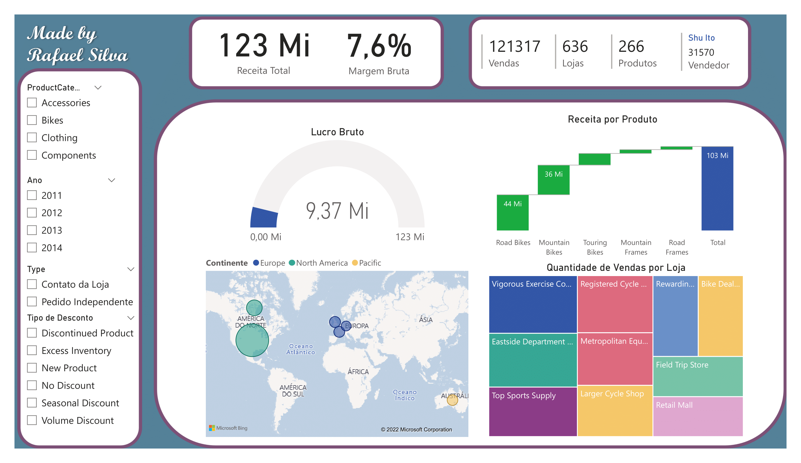

# Projeto AdventureWorks 2017

A ideia deste projeto foi de aplicar meus conhecimentos de SQL e Power BI. Para isso eu resolvi fazer um desafio para mim mesmo que consistiu em extrair informações úteis do banco de dados Adventure Works 2017, disponibilizado pela Microsoft através do link: https://bit.ly/3StsbGh e através destas informações criar um dashboard com os principais indicadores da empresa fictícia. 

O tema escolhido para o projeto foi de vendas, após escolher o tema separei as informações úteis, modelei os dados no formato SnowFlake Schema e produzi o painél que pode ser visualizado a seguir.

  

Para ter acesso diretamente ao Dashboard produzido, basta ter o Power BI instalado em sua máquina e abrir o arquivo 'sales_final.pbix'. Além disso, o arquivo 'ETL_final.sql' mostra os comandos SQL que utilizei para extrair os dados, que foram zipados no arquivo 'sales_csv_v3.rar' e também estão separados por sheets (planilhas) no arquivo 'fVendas_final.xlsx'. 

As pastas 'Versao1' e 'Versao2' reúnem o histórico de versões deste projeto para caso o leitor tenha curiosidade de verificar como o mesmo chegou até sua versão definitiva. Qualquer dúvida estou à disposição!

Att,  
Rafael.

---

  

