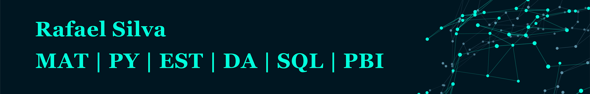

# Projetos_Data_Science
Meu portfólio de projetos de Data Science

  

# Rafael Silva (Matemático)

Me apaixonei por Estatística e Programação durante minha graduação em Matemática e logo que me formei (ago/2022) parti para uma formação em Data Science na Sigmoidal. Minha missão é transformar uma montanha de dados em informações valiosas que auxiliem à tomada de decisão e criar modelos de aprendizagem de máquina que as tornem melhores tomadoras de decisões do que humanos. 

Minha graduação é em Matemática na Universidade do Estado de Santa Catarina, tendo desenvolvido plenas capacidades analíticas durante este período.

**Background in:** Matemática, Estatística, Python, Machine Learning.

**Links:**
* [LinkedIn](https://www.linkedin.com/in/rafael-silva-a76945249/)
* [Medium](https://medium.com/@cadeosdados)

## Projetos:
Veja os projetos em que apliquei meus conhecimentos de Data Science a seguir:

* **Como usar o Histograma para Data Science:** https://bit.ly/2L2cMwy
* **Como Implementar Regressão Linear com Python:** https://bit.ly/2Li5pzY
* **Data Science: Investigando o naufrágio do Titanic:** https://bit.ly/2Ubr5SH
* **Como Tratar Dados Ausentes com Pandas:** https://bit.ly/31KWSMN
* **XGBoost: aprenda este algoritmo de Machine Learning em Python:** https://bit.ly/2UbRhws
* **Como criar uma Wordcloud em Python:** https://bit.ly/2OxsphM
* **Como lidar com dados desbalanceados:** https://bit.ly/2ZlaNsV

---
